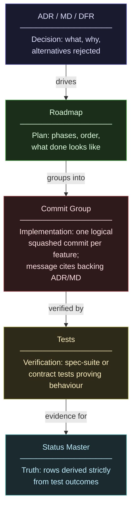

# Work Done Policy

> A document without a status table is a document that cannot answer the question: "Is this actually done?"

Every ADR, MD, DFR, Spec, and Roadmap in this repository must carry a **status table**
that records what shipped, what did not, what is in flight, and the exact commit where
each state was established. The table is the document's ground truth - not its prose,
not its headings, not its author's memory.

---

## Decision Flow (Mandatory)

All new work must follow this chain in order. No step may be skipped.



### What each layer means

| Layer | Document(s) | Answers | Owned by |
|---|---|---|---|
| **Decision** | ADR, MD, DFR | Why this design? What alternatives were rejected? | Decision owner |
| **Roadmap** | RDMP-*.md | How do we get there? What phases, in what order? | Team lead |
| **Commit group** | git history | What exactly changed? Which roadmap item does this close? | Developer |
| **Tests** | Contract tests, spec-suites | Does the implementation actually do what was decided? | Developer |
| **Status Master** | Project status document | What is provably done, right now, based on test evidence? | Derived — not authored |

### Rules

- ADRs/MDs **drive** Roadmaps. A Roadmap with no backing ADR/MD is a plan without a rationale.
- A Roadmap **groups** work into commit-sized deliverables. One commit per roadmap phase or feature.
- Every commit message **cites** its backing ADR/MD (e.g. `feat(auth): implement JWT refresh per ADR-012`).
- Tests **prove** the behaviour. A feature is not done because the code compiles — it is done because tests pass.
- Status Master rows are **derived**, never authored. Mark `[x]` only when a test passes and a commit SHA exists.
- Implementation details already covered by an existing ADR/MD do not need a new decision doc — they are details of an already-decided design.
- If work starts without a backing ADR/MD, stop and write one first.

---

## Why This Exists

Architecture documents accumulate stale content. A decision is made, partially
implemented, then the scope changes - but nobody updates the document. Six months
later a new contributor reads "Done" in a heading and trusts it. The code disagrees.

The status table solves this by making staleness visible:

- Every item has an explicit state symbol, not a prose claim.
- Every shipped item has a commit SHA - if no commit exists, it is not shipped.
- Every date is absolute, not relative ("last week", "recently").
- Partial and WIP states are first-class - they are not omitted out of embarrassment.

---

## Status Symbols

| Symbol | Meaning | When to use |
|--------|---------|-------------|
| `[x]` | **Shipped** | Complete, tested, in the build or runtime. A commit SHA is mandatory. |
| `[ ]` | **Not done** | Not started. No design, no code, no tests. |
| `[~]` | **Partial** | Some sub-items shipped, some have not. Notes must state what is missing. |
| `[*]` | **WIP** | Actively in progress this cycle. Expected to become `[x]` or `[~]` soon. |
| `[.]` | **Deferred** | Intentionally postponed. Notes must state the blocker or trigger condition. |
| `[!]` | **Cancelled** | Decided against. Notes must state why - do not delete the row. |

**Rules:**
- `[x]` without a commit SHA is invalid. Fill the commit or downgrade to `[~]`.
- `[*]` without an owner or active branch is invalid. Downgrade to `[ ]` or `[.]`.
- Never delete a row. `[!]` preserves the decision trail.

---

## Standard Status Table

Every covered document must include a section named **Status** containing this table.
Add it immediately after the document's opening summary or decision block.

```markdown
## Status

| Sub-topic | Related Area | Status | Notes | Commit | Date |
|-----------|--------------|--------|-------|--------|------|
| Brief label for this item | Component / layer this touches | [x] | One line: caveat, blocker, or "-" | `abc1234` | YYYY-MM-DD |
```

### Column definitions

| Column | Type | Rules |
|--------|------|-------|
| **Sub-topic** | Short label | Match the heading or rule ID where possible. No prose. |
| **Related Area** | Component name | Name the system layer, module, or tool. |
| **Status** | Symbol | One of the six symbols above. No free-text status. |
| **Notes** | One sentence | State the exception, blocker, or sub-item gap. Use `-` if none. |
| **Commit** | Short SHA | The commit that shipped this item. Format: inline code `abc1234`. Use `-` if not yet shipped. |
| **Date** | ISO 8601 | Date of the commit, or date the status was last reviewed. Format: `YYYY-MM-DD`. |

---

## Document-Type Rules

### ADR (Architecture Decision Records)

The status table records the **implementation items** implied by the decision, not the
decision itself (the decision is captured in the ADR body). Each row is one concrete
deliverable the decision requires.

### MD (Major Decisions)

The status table records whether the **design decision itself** has been ratified and
whether its downstream consequences have been acted on. One row per consequence.

### DFR (Drift Reports)

The status table records each **drift item** identified in the report. Status reflects
whether the drift has been resolved, is being resolved, or is accepted as intentional.

### Roadmap (RDMP)

The status table is the **tracker** for the roadmap's deliverables. Each phase or named
item gets a row. The roadmap body may contain narrative, but the table is the canonical
state of play.

---

## Maintenance Rules

1. **Update on merge, not on plan.** Change a row's status when the commit lands on
   the integration branch, not when the task is started.

2. **One row per atomic deliverable.** If a row would need two commits and two dates, it
   is two rows.

3. **The table owns the state. The prose does not.** If the body says "Done" but the
   table says `[ ]`, the table is authoritative and the prose must be corrected.

4. **Deferred rows must carry a trigger.** `[.]` without a condition ("blocked until
   feature X ships", "deferred until Phase 2 is complete") is not allowed.

5. **Commits are immutable evidence.** A SHA in the Commit column is a permanent
   record. Do not remove it, even if the row is later cancelled (`[!]`).

6. **Review cadence.** At the start of any session that touches a document, scan its
   status table. If any `[*]` row has had no commit for more than two weeks without an
   explanation, downgrade it to `[.]` and add a note.

7. **Status derives from tests.** Project status rows must reflect actual test outcomes
   only. Never mark a feature shipped based on code inspection alone.

---

## Method of Elimination (large test failure counts)

When a test run produces a large number of failures, do not attempt to fix them
individually. Most failures in a batch share a root cause — fix the root and the
rest resolve automatically.

**The practice:**

1. Run the suite. Note the failure count.
2. Pick the **first failing test**. Read only the snippet and the failure message —
   nothing else.
3. Diagnose the root cause from that one test. It is almost always representative
   of a whole category.
4. Fix it. Re-run.
5. Observe how many failures disappeared. The delta tells you whether you found the
   root cause or a symptom.
6. Repeat with the next first failing test until the count is zero or the remaining
   failures are unrelated noise.

**Why this works:** a large failure count is not a large number of problems. It is
usually one or two broken contracts propagating through every test that depends on
them. The first failing test exposes the contract. The fix collapses the cascade.

**Rule:** never file a status row as `[x]` based on a partial run or a filtered
subset. The full suite must pass, or the remaining failures must be explicitly
accepted as known pre-existing failures with a note in the status table.

---

## What Not To Do

These are the failure patterns this policy exists to prevent. Each one has been
observed in practice. None of them feel like mistakes while they are happening.

### Stay distant from test evidence

Architectural decisions made without reading test output are decisions made without
evidence. The test suite is not a CI gate to pass — it is the most precise
description of what the system actually does. Read it. Not all of it. The first
failure. Regularly.

*The symptom:* a feature is marked done because the code compiles and looks right.
The tests disagree. Nobody noticed.

### Commit without a roadmap item

Commits that are not traceable to a roadmap item are commits that cannot be
reviewed, reverted, or explained to a future contributor. "I was fixing things"
is not a commit message. "feat(auth): implement refresh token per ADR-012" is.

*The symptom:* 70+ commits on a branch, half of them `fix`, `update`, `wip`.
The branch cannot be cleanly squashed because nobody can tell what belongs together.

### Start strong, context-switch before done

A feature that is 80% implemented is not 80% valuable. It is a liability — it
occupies a status row, blocks dependent work, and requires future context
reconstruction. A `[~] Partial` row that stays partial for two weeks is a sign
that the feature was abandoned mid-flight.

*The symptom:* the project status document has more `[~]` rows than `[x]` rows.
Roadmap phases never fully close.

### Write specs after the code

A spec written after the code describes what was built, not what was decided.
It cannot catch implementation mistakes because the implementation already defined
what "correct" means. The spec becomes documentation, not a contract.

*The symptom:* specs that match the implementation exactly, including its bugs.
Tests pass because they were written against the code, not the spec.

---

## Legend Block (copy-paste for document headers)

Every document that carries a status table should include this legend directly above
the table:

```markdown
> **Status legend:** [x] Shipped - [ ] Not done - [~] Partial - [*] WIP - [.] Deferred - [!] Cancelled
```
